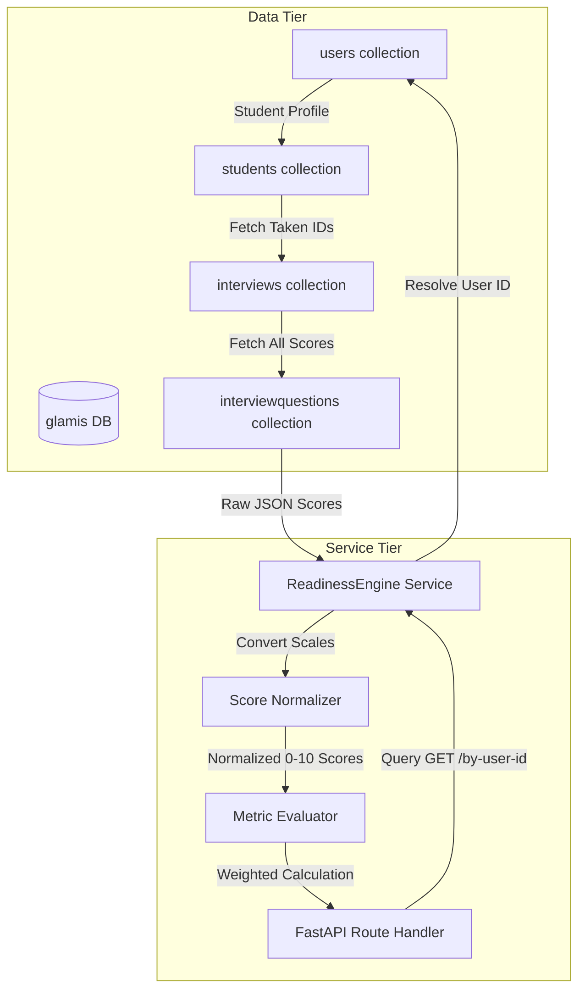

# GLAMIS Readiness Engine

The **Readiness Engine** is the core diagnostic module of the GLAMIS mock interview platform. It evaluates student performance history across multiple dimensions (technical accuracy, verbal fluency, consistency, and exam completion rates) to compute a unified readiness score and target category.

This score acts as the foundation for the AI Assignment Agent to make automated personalized exam recommendations.

---

## 1. Mathematical Formulas

The readiness score is calculated on a standard `0 - 10` scale using a weighted average of four components:

$$\text{Readiness Score} = (\text{Technical Performance} \times 0.40) + (\text{Communication} \times 0.25) + (\text{Consistency} \times 0.20) + (\text{Interview Completion} \times 0.15)$$

### Component breakdown:

1. **Technical Performance ($TP$) [40% Weight]**: 
   Average score of technical metrics across all completed interviews. Individual questions are graded for `technicalSkills` and `correctness` on a `0-10` scale.
   
2. **Communication ($C$) [25% Weight]**:
   Average score of linguistic metrics across all completed verbal/SVAR interviews. Metrics include `grammar`, `vocabulary`, `fluency`, and `pronunciation`.
   
3. **Consistency ($CS$) [20% Weight]**:
   Calculated by evaluating the standard deviation ($\sigma$) of the overall scores of completed sessions:
   - If the candidate has less than 2 completed sessions: $CS = 10.0$
   - Otherwise:
     $$\sigma = \sqrt{\frac{\sum_{i=1}^{n} (x_i - \bar{x})^2}{n}}$$
     $$CS = \max(0.0, 10.0 - (\sigma \times 2.0))$$
   
4. **Interview Completion ($IC$) [15% Weight]**:
   Measures candidate commitment by comparing completed interviews against total scheduled/attempted interviews:
   $$IC = \frac{\text{completed\_interviews}}{\text{total\_interviews}} \times 10.0$$

---

## 2. Readiness Category Map

Ready scores are mapped into five performance categories:

| Score Range | Category | Description |
| :--- | :--- | :--- |
| **0.0 - 3.9** | **At Risk** | Candidate shows severe weaknesses in technical correctness or communication, or has skipped/failed multiple interviews. |
| **4.0 - 5.9** | **Needs Improvement** | Candidate has baseline skills but struggles with consistency and advanced topics. |
| **6.0 - 7.4** | **Good** | Solid overall performance. Meets basic criteria but requires refinement in weak areas. |
| **7.5 - 8.9** | **Placement Ready** | Ready for standard corporate placement interviews. High scores and high consistency. |
| **9.0 - 10.0** | **Excellent** | Exceptional command of technical concepts and communication skills. |

---

## 3. Data Flow Diagram



---

## 4. API Documentation

### GET `/api/v1/admin/readiness/by-user-id/{user_id}`

#### Request Parameters
- `user_id` (Path, required): The unique MongoDB ObjectId string of the target user.

#### Example Response (HTTP 200)
```json
{
  "userId": "64a2b2c8f8e12b34a6789012",
  "candidateName": "John Doe",
  "readinessScore": 8.12,
  "technicalScore": 8.0,
  "communicationScore": 7.8,
  "category": "Placement Ready",
  "weakSubjects": ["OS"],
  "strongSubjects": ["DSA", "DBMS"],
  "totalInterviews": 5,
  "consistencyScore": 9.2,
  "trend": "Improving"
}
```

---

### POST `/api/v1/admin/readiness/bulk`

#### Request Payload
```json
{
  "userIds": [
    "64a2b2c8f8e12b34a6789012",
    "64a2b2c8f8e12b34a6789013"
  ]
}
```

#### Example Response (HTTP 200)
```json
[
  {
    "userId": "64a2b2c8f8e12b34a6789012",
    "candidateName": "John Doe",
    "readinessScore": 8.12,
    "technicalScore": 8.0,
    "communicationScore": 7.8,
    "category": "Placement Ready",
    "weakSubjects": ["OS"],
    "strongSubjects": ["DSA", "DBMS"],
    "totalInterviews": 5,
    "consistencyScore": 9.2,
    "trend": "Improving"
  },
  {
    "userId": "64a2b2c8f8e12b34a6789013",
    "candidateName": "Jane Smith",
    "readinessScore": 5.4,
    "technicalScore": 4.8,
    "communicationScore": 5.9,
    "category": "Needs Improvement",
    "weakSubjects": ["DSA", "DBMS"],
    "strongSubjects": [],
    "totalInterviews": 3,
    "consistencyScore": 6.8,
    "trend": "Declining"
  }
]
```
